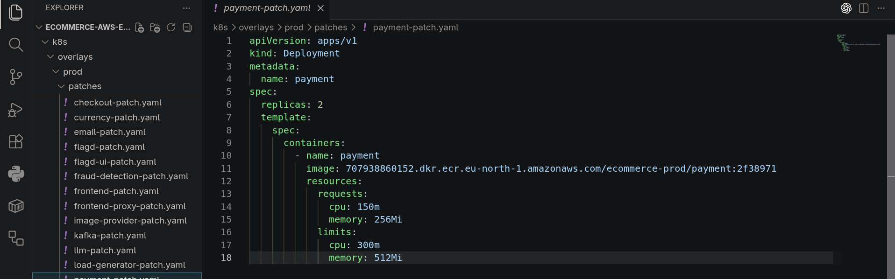
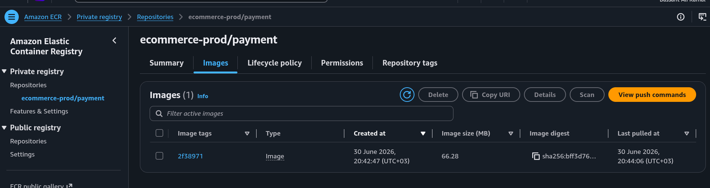
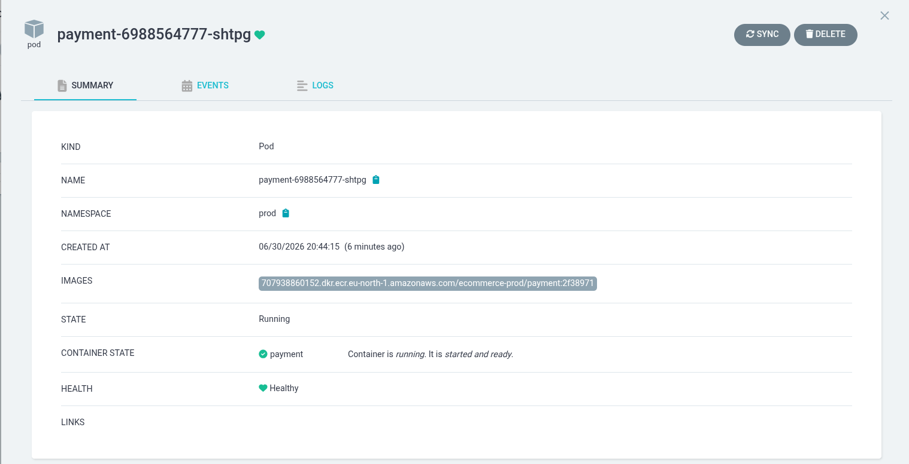

**Note:** This project is a fork of `opentelemetry-demo`. Thanks to the team and contributors for opensourcing this wonderful demo project. Definitely one of the best on internet.

## Documentation

For detailed documentation, see [Demo Documentation][docs]. If you're curious
about a specific feature, the [docs landing page][docs] can point you in the
right direction.

## Demos featuring the Astronomy Shop

We welcome any vendor to fork the project to demonstrate their services and
adding a link below. The community is committed to maintaining the project and
keeping it up to date for you.

|                           |                |                                  |
|---------------------------|----------------|----------------------------------|
| [AlibabaCloud LogService] | [Elastic]      | [OpenSearch]                     |
| [AppDynamics]             | [Google Cloud] | [Sentry]                         |
| [Aspecto]                 | [Grafana Labs] | [ServiceNow Cloud Observability] |
| [Axiom]                   | [Guance]       | [Splunk]                         |
| [Axoflow]                 | [Honeycomb.io] | [Sumo Logic]                     |
| [Azure Data Explorer]     | [Instana]      | [TelemetryHub]                   |
| [Coralogix]               | [Kloudfuse]    | [Teletrace]                      |
| [Dash0]                   | [Liatrio]      | [Tracetest]                      |
| [Datadog]                 | [Logz.io]      | [Uptrace]                        |
| [Dynatrace]               | [New Relic]    |                                  |

---

# CI/CD Pipeline

This repo contains the application source code for the ecommerce demo's microservices. There are two workflows: one that automatically builds and deploys changed services to `dev`, and one that manually promotes an already-tested image from `dev` to `prod`. Both deploy into the separate [`ecommerce-aws-eks-devops`](https://github.com/Besso2003/ecommerce-aws-eks-devops) repo, which ArgoCD watches.

## Workflow 1 — Build and Push to ECR (dev)

Triggers automatically on every push to `main`.

```
1. detect-changes   — figures out which of the 15 tracked services
                       actually had files change in this push
2. build-and-push    — for each changed service, in parallel:
                          builds its Docker image, tags it with the
                          short git SHA, pushes both that tag and
                          :latest to its ECR repository in ecommerce-dev
3. update-manifests   — clones ecommerce-aws-eks-devops, updates the
                          image tag for every service that was just
                          built, and pushes ONE combined commit back
                          to that repo
```

ArgoCD (running in the separate `platform` hub cluster) watches `ecommerce-aws-eks-devops` and picks up that commit automatically — no further action is needed for a change to reach the `dev` cluster.

## Workflow 2 — Promote to Prod

Triggers manually, via the **Run workflow** button on the Actions tab, with one required input: the service name to promote (e.g. `cart`).

```
1. Reads the CURRENT image tag from ecommerce-dev's patch file for
   that service — this is whatever's already running in dev right now
2. Pulls that exact image from ecommerce-dev/<service> in ECR,
   re-tags it, and pushes it to ecommerce-prod/<service> - the SAME
   artifact, never rebuilt
3. Updates k8s/overlays/PROD/patches/<service>-patch.yaml with that
   tag (inserting the image: line if it doesn't exist yet, same as
   the dev pipeline does)
4. Opens a Pull Request in ecommerce-aws-eks-devops, rather than
   pushing directly to main
```

A human then reviews and merges that PR like any other change. Only on merge does ArgoCD deploy the promoted image to `prod`. This is the deliberate gate that keeps `prod` from ever being touched automatically just because code merged to `main` — promoting is always a separate, intentional action with its own reviewable record.

This follows the "build once, deploy everywhere" principle: the image running in `prod` is byte-for-byte the same image that was already running in `dev`, not a fresh build from the same source. Rebuilding separately for `prod` would risk subtly different behavior (different base image layer pulled at build time, a dependency patch version drifting) even from identical source code.



The image lands in its own `ecommerce-prod/<service>` repository, separate from `ecommerce-dev/<service>` — confirmed directly in the AWS Console:



Once the opened PR is merged, ArgoCD picks up the new tag and deploys it to the `prod` cluster:



## Why services are built from the repo root, not their own folder

Every service's `Dockerfile` (including ones that look self-contained at first glance) references shared files outside its own folder — most commonly `pb/demo.proto`, the protobuf contract shared across services. Because of this, every build in this pipeline uses the **repo root** as its Docker build context, even though the `Dockerfile` itself lives inside `src/<service>/`. The `-f` flag points at the Dockerfile's actual location; the context (what files Docker can see) is always `.`.

## Per-service quirks the pipeline accounts for

```
cart            — Dockerfile lives at src/cart/src/Dockerfile,
                   not src/cart/Dockerfile (a .NET project
                   convention from the upstream demo project)

ad              — folder is named "ad", but its ECR repository
                   and Kubernetes deployment are named "ad-service"

recommendation  — folder is named "recommendation", but its ECR
                   repository and Kubernetes deployment are named
                   "recommendation-service"
```

These three are handled explicitly in both workflows' case statements. Every other service's folder name, ECR repository name, and Dockerfile path all match the simple pattern `src/<service>/Dockerfile` → `ecommerce-dev/<service>` (and `ecommerce-prod/<service>` once promoted).

## Services NOT covered by either pipeline

```
flagd, flagd-ui     — third-party images (open-feature project),
                       not built from this repo's code

kafka, postgres,
valkey               — third-party / infrastructure images, not
                       application code

prometheus, grafana,
jaeger, opensearch,
otel-collector         — observability stack, not part of the
                          23 services currently deployed via
                          k8s/overlays in the infra repo

react-native-app        — has no corresponding Kubernetes
                            deployment currently

product-reviews, llm    — referenced in the infra repo's k8s
                            manifests at one point, but have no
                            corresponding folder in this repo's
                            src/ directory. product-reviews was
                            removed from the dev overlay (see
                            "Known issues" below); llm has not
                            been investigated yet.
```

## How authentication works (no stored AWS keys)

Both workflows authenticate to AWS using **OIDC federation**: GitHub issues a short-lived, cryptographically signed token identifying the exact repo and branch the workflow is running from. AWS validates that token against an IAM role (`github-actions-ecr-push`) whose trust policy only accepts tokens from `repo:Besso2003/ecommerce-source-code:ref:refs/heads/main`. No AWS access key or secret is stored anywhere in this repo or its GitHub secrets.

The IAM role itself is provisioned in the infra repo's Terraform (`Terraform/bootstrap/`). It can push images to **both** `ecommerce-dev/*` and `ecommerce-prod/*` ECR repositories — `ecommerce-prod/*` access was added specifically so the Promote to Prod workflow can copy an image across registries — and it can pull (`GetDownloadUrlForLayer`, `BatchGetImage`) from both for the same reason. It has no permissions outside ECR at all.

## How the cross-repo commit and PR creation work

Pushing a commit (and, for the promote workflow, opening a Pull Request) into `ecommerce-aws-eks-devops` from a workflow running in this repo requires write access to that other repo. This is handled by a dedicated **GitHub App** (`ecommerce-ci-bot`), installed on both repos with `Contents: Read and write` **and** `Pull requests: Read and write` permissions. The workflow exchanges the App's credentials for a short-lived (~1 hour) installation token at runtime. The App's private key is stored as a GitHub Actions secret (`CI_BOT_PRIVATE_KEY`) and is never written to disk outside the workflow's own memory.

The `Pull requests` permission was added after the Promote to Prod workflow's first real run failed with `"Resource not accessible by integration"` — the App originally only had `Contents` access, which is enough to push a branch but not enough to call the Pull Requests API to open one against it.

## Known issues

- **`product-reviews`** was deployed in the dev overlay but its server code expected a `ProductReviewService` gRPC contract that was never added to the shared `pb/demo.proto` file. This caused a permanent `CrashLoopBackOff`. It has been removed from `k8s/overlays/dev/kustomization.yaml` until the protobuf definition is written and the service is properly finished.
- **`llm`** has no corresponding folder in this repo's `src/` directory despite being referenced in the infra repo's deployments. Not yet investigated.
- **Destroying and recreating the `dev` or `prod` EKS cluster wipes ECR.** The image tag committed in a patch file (`k8s/overlays/<env>/patches/<service>-patch.yaml`) lives in git and survives a cluster destroy untouched, but the actual image it points to does not — `terraform destroy` for an environment deletes its ECR repositories along with everything else. After recreating a cluster, any service whose patch file references a tag that no longer exists will fail with `ImagePullBackOff` until that service is rebuilt (push a trivial change to its `src/<service>/` folder to trigger Workflow 1 again) or, for `prod`, re-promoted (re-run Workflow 2, since the image needs to be re-copied into the freshly emptied `ecommerce-prod/*` repo too).

## Adding a new service to the pipeline

1. Add the service's folder name to the `filters:` list in the `detect-changes` job of `.github/workflows/build-and-push-dev.yml`
2. If its Dockerfile path or ECR name doesn't follow the standard `src/<service>/Dockerfile` → `ecommerce-dev/<service>` pattern, add a case for it in `build-and-push-dev.yml`'s case statement, its `update-manifests` job's `ecr_name_for()` function, **and** the same two spots in `promote-to-prod.yml`
3. Make sure matching `k8s/overlays/dev/patches/<service>-patch.yaml` and `k8s/overlays/prod/patches/<service>-patch.yaml` files exist in the infra repo — both pipelines insert a new `image:` line automatically the first time they run for that service, but only if the patch file itself already exists